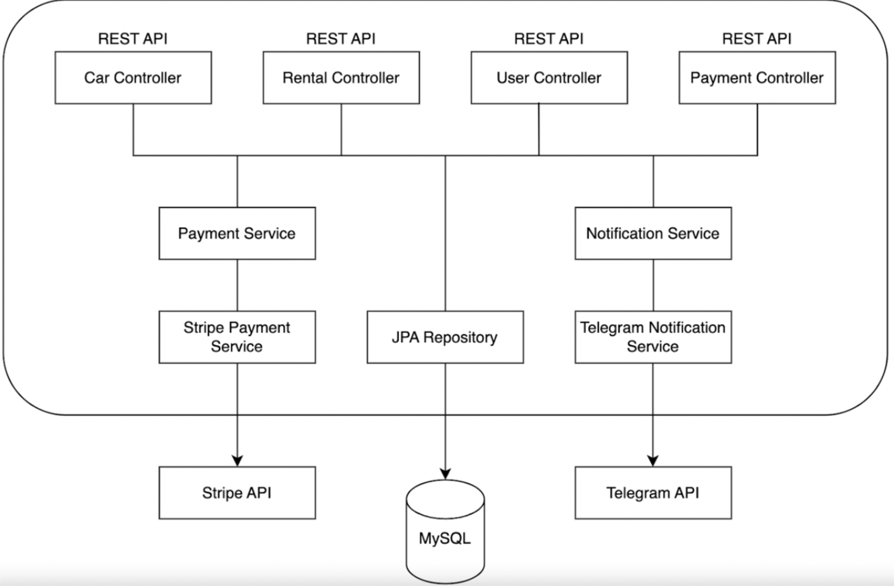
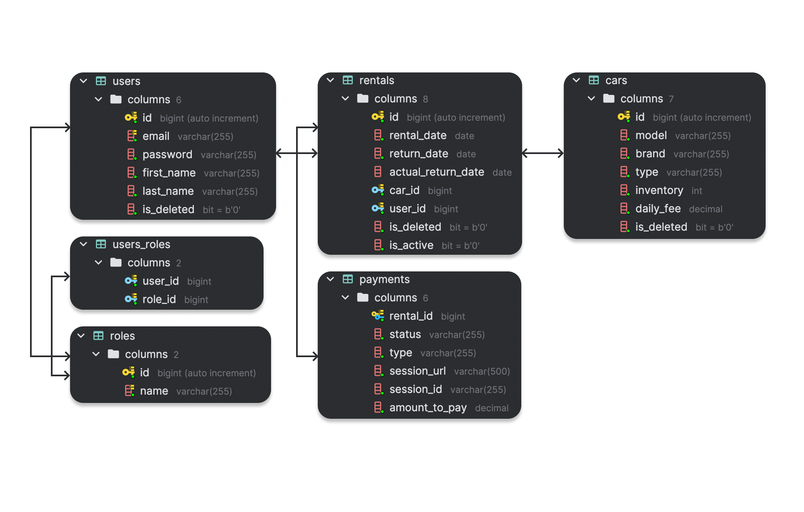

<h1 align="center" style="display: block; font-size: 1em; font-weight: bold; margin-block-start: 0.5em; margin-block-end: 1em;">
<picture>

</picture>
<br /><br /><strong>🚗 Car Sharing App 🚗</strong>
</h1>

# 🧭 Navigation list

---

<div>

- [Introduction](#-introduction)
    - [Description](#description)
    - [What problems does my project resolve?](#what-problems-does-my-project-resolve)
- [Technologies and Tools](#-technologies-and-tools)
    - [Technologies](#technologies)
    - [Tools](#tools)
- [Project architecture](#-architecture)
- [Functionality of controllers](#-unique-functionality-of-controllers)
    - [Authentication management](#-authentication-controller)
    - [User management](#-user-controller)
    - [Car management](#-car-controller)
    - [Rental management](#-rental-controller)
    - [Payment management](#-payment-controller)
- [Database structure](#-database-structure-entity-relationships)
- [Set up and starting project](#-set-up-and-starting-project)
- [API Documentation](#-api-documentation)
- [Postman collection](#-postman-collection)
- [Contacts](#-contacts)

</div>

<div>

# 📝 Introduction

---

### **Description**

There is a car sharing service in your city, where you can rent cars and pay for your usage using cash, depending on 
the duration of your rental. The problem is, the system for tracking cars, rentals, users, and payments in the car 
sharing service is outdated - everything is managed manually and all records are kept on paper. There is no way to 
check the availability of specific cars in the service. Additionally, you can only make payments with cash. There is 
no support for credit cards. The car sharing service administration has no way of knowing who returned the car on time 
and who did not.

### **What problems does my project resolve?**

This web application addresses to solve all above problems. It provides a seamless platform where users can easily 
find a car and create an online rental in a user-friendly and efficient manner.
The implemented payment system made it possible to pay not only in cash, but also by credit card.
Moreover, it resolves common challenges such as find and view specific or all rental/s, offering a well-structured
interface that supports both users and administrators in handling data efficiently.
Now managers have possibility to receive messages about users actions, such as a new rentals created, successful or 
cancelled payments and overdue rentals in Telegram CarRentalBot online.
This project also paves the way for scalability, allowing for future expansion to include new features. 

</div>

# 🛠 Technologies and tools

<div>

---

### Technologies:

- **JAVA 17**
- **Spring Framework** (v3.4.4):
    - Spring Boot
    - Spring Data JPA
    - Spring Boot Security
    - Spring Boot Validation
- **Database:**
    - MySQL (v8.0.33)
    - Liquibase (Database migration tool): v4.29.2
- **Lombok**
- **MapStruct**
- **JSON Web Tokens**
- **Tomcat**
- **Hibernate**
- **SpringDoc OpenAPI & Swagger UI**
- **Stripe API (v29.0.0)**
- **Telegram bots API (v6.0.1)**

### Tools:

- **IntelliJ IDEA 2025.1 (UE)**
- **Maven**
- **JUnit 5**
- **Docker**
- **Testcontainers**
- **Postman**
- **GitHub**
- **AWS**


# 🏗️ Architecture

---
  

</div>

<div>

# 🎯 Unique functionality of controllers

---

### 👤 Authentication controller

The Auth Controller handles registration and authentication processes for users.

| HTTP Request | Endpoint         | Description                                                                          |
|--------------|------------------|--------------------------------------------------------------------------------------|
| POST         | `/auth/register` | Allows new users to sign up by providing their email, password, and personal details |
| POST         | `/auth/login`    | Authenticates a user and provides a JWT for accessing protected endpoints            |

### ️👨 User controller

The User Controller manages the viewing, update, and deletion of users with role-based access control.

| HTTP Request | Endpoint           | Description                                                  |
|--------------|--------------------|--------------------------------------------------------------|
| GET          | `/users/me`        | Retrieves detailed information info about authenticated user |
| PUT          | `/users/{id}/role` | Update user roles for a specific user by its ID              |
| PUT          | `/users/me`        | Update profile info to authenticated user                    |
| DELETE       | `/users/{id}`      | Delete a specific user by its ID                             |

### 🚘 Car controller

Car Controller provides endpoints for managing cars, including CRUD operations and listing all available cars.
Access is role-based to ensure security.

| HTTP Request | Endpoint        | Description                                               |
|--------------|-----------------|-----------------------------------------------------------|
| POST         | `/cars`         | Create a new car and save to database                     |
| GET          | `/cars`         | Retrieve a paginated list of all available cars           |
| GET          | `/cars/{carId}` | Retrieve detailed information of a specific car by its ID |
| PUT          | `/cars/{carId}` | Update info an existing car by its ID                     |
| DELETE       | `/cars/{carId}` | Delete a car by its ID                                    |

### 🔑 Rental controller

The Rental Controller manages the creation, retrieval, and updating of rentals. It supports both
user-specific operations and administrative tasks for managing rentals.

| HTTP Request | Endpoint                     | Description                                                                     |
|--------------|------------------------------|---------------------------------------------------------------------------------|
| POST         | `/rentals`                   | Create an rental and save to database                                           |
| POST         | `/rentals/{rentalId}/return` | Set actual return date of an rental (close rental)                              |
| GET          | `/rentals/search`            | Retrieve a paginated list of all rentals by search parameters                   |
| GET          | `/rentals`                   | Retrieve a paginated list of all rentals placed by the currently logged-in user |
| GET          | `/rentals/{rentalId}`        | Retrieve detailed information of a specific rental by its ID                    |

### 💵 Payment controller

The Payment Controller manages the creation, retrieval, modification, renew and canceling user payments. It
ensures that only authenticated users can interact with their payments.

| HTTP Request | Endpoint                | Description                                                                |
|--------------|-------------------------|----------------------------------------------------------------------------|
| POST         | `/payments`             | Create new payment (create Stripe session fro payment)                     |
| POST         | `/payments/{paymentId}` | Renew payment (create new Stripe session for payment)                      |
| GET          | `/payments`             | Retrieve a paginated list of all payments the currently authenticated user |
| GET          | `/payments/success`     | Update payment status to successful (endpoint for stripe redirection)      |
| GET          | `/payments/cancel`      | Update payment status to cancelled (endpoint for stripe redirection)       |

</div>

<div>

# 🗂️ Database structure (entity relationships)

---

  

#### *Role: CUSTOMER*

- Can register an account.
- Can edit own profile info.
- Can watch all available cars for rent and their detailed information.
- Can create new car rental.
- Can retrieve all own existing rentals, or find one of them by ID.
- Can create new payment and retrieve all own existing payments.
- Сan make a payment or cancel it.
- Can renew an expired payment.

#### *Role: MANAGER*

- Has the ability to add, update, and delete cars in the system.
- Can manage users, deleting them or updating user roles.
- Has the authority to close the rentals and have full search for all available users rentals.

</div>

<div>

# ⚙️ Set up and starting project

---

## Steps

1. Prerequisites [Docker](https://www.docker.com/get-started)
   and [Docker Compose](https://docs.docker.com/compose/install/) on your machine.
2. Clone the Repository
   ```sh
    git clone https://github.com/ihor-sydorenko/car-sharing-app.git
    ```
3. Navigate to the project directory
    ```sh
     cd car-sharing-app
    ```
4. Configure Environment variables:

- Create a `.env` file in the project directory to store your database credentials. This file should contain the
  necessary environment variables, such as `DB_DATABASE`, `DB_USER`, and `DB_PASSWORD`.

  ```sh
  MYSQLDB_USER=<your_database_username>
  MYSQLDB_ROOT_PASSWORD=<your_database_password>
  MYSQLDB_DATABASE=car_sharing_app
  MYSQLDB_LOCAL_PORT=3307
  MYSQLDB_DOCKER_PORT=3306

  SPRING_LOCAL_PORT=8088
  SPRING_DOCKER_PORT=8080
  DEBUG_PORT=5005

  JWT_EXPIRATION=3000000
  JWT_SECRET=<your_jwt_secret>
  ```
- Replace the placeholders <your_database_username>, <your_database_password>, and <your_jwt_secret> with actual values.
- Update the `application.properties` file located in the `src/main/resources` directory with your specific database
  connection details and any other necessary configurations.

5. Build and Start the application:

- Use the following command to start the application and all required services via Docker Compose:
   ```sh
  docker compose up --build 
   ```
- Wait for the services to start. You should see logs indicating that the application and database are running.

6. Access the Application:

- If you are accessing the application locally (outside the container), use the port defined in `SPRING_LOCAL_PORT`.
  Since the `context-path` is set to `/api`, the application will be accessible at:
  http://localhost:8080/api


- If you are working inside a container, the application will be accessible on the port defined in `SPRING_DOCKER_PORT`.
  Use the following address:
  http://localhost:8088/api

### Additional Notes:

- `SPRING_LOCAL_PORT`, `SPRING_DOCKER_PORT`, and `DEBUG_PORT` define the ports for the application and debugging and
  should match your local and containerized setup.
- The separation of ports (`SPRING_LOCAL_PORT` and `SPRING_DOCKER_PORT`) allows you to work locally on one port and
  expose another port for Docker containers.
- Ensure you are accessing the correct port depending on your working environment.

</div>

<div>

# 🖇️ API Documentation

---

To explore and test the API endpoints, you can use Swagger. Swagger provides interactive API documentation that allows
you to test endpoints directly from the browser.

### - **[Swagger Documentation](http://localhost:8088/api/swagger-ui/index.html)**

<div>

# 📬 Postman collection

---
You can find a Postman collection in docs/car-sharing-app.postman_collection.json. To use this:
[car-sharing-app.postman_collection.json](docs/car-sharing-app.postman_collection.json)

1. Import the file into Postman.
2. Adjust Authorization headers (use JWT obtained from login endpoint).
3. Test all exposed APIs such as authentication, rental and payment management, and more.


- #### Short instruction how to use postman collection:

https://www.loom.com/share/159f6aa3a97642c6a311f6bac6878add?sid=012a4bd2-dd09-453c-a36e-20310b64346f
</div>

</div>

<div>

# 📧 Contacts

---

Feel free to reach out for feedback or questions:

- GitHub: [Ihor Sydorenko](https://github.com/ihor-sydorenko)
- Email: sidorenko.igorek@gmail.com

</div>
